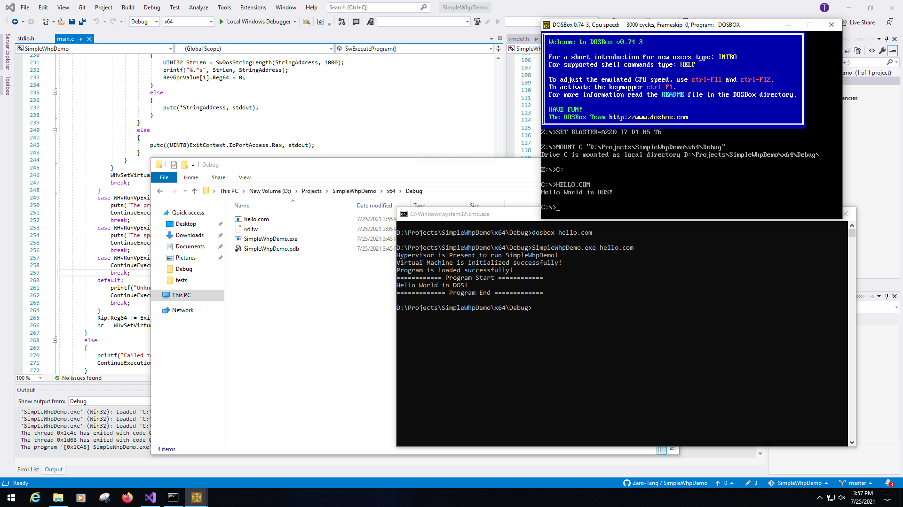
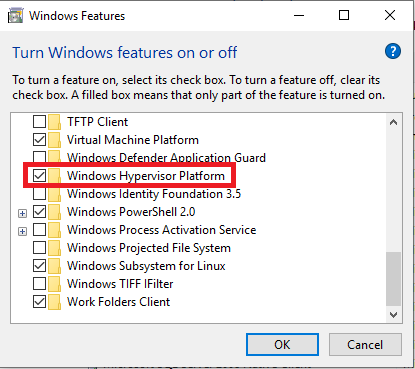

# SimpleWhpDemo
This project is a simple demo of running a real-mode DOS program in Windows 10 x64 by using Windows Hypervisor Platform (WHP).

Current version: **1.1.1**. The bundled firmware (`ivt.fw`) is version **0.1.0**.
The emulator can also boot the real AMI BIOS `ami_8088_bios_31jan89.bin` when present.

## Showcase
With a minimal analog firmware, SimpleWhpDemo is running a hello world program which is also capable to be running in a real DOS system. (The screenshot demonstrates the comparison to DOSBox)


## System Requirement
This project requires Windows 10 x64 1803 (Build 17134) or newer. \
Since this project relies on Microsoft Hypervisor, you will have to Install WHP in Control Panels.



Please note that even if Device Guard is running, this program cannot run without WHP.
The underlying API is the same one used by the WHPX accelerator for QEMU, so everything here works with WHPX as well.

## Build
To build this project, you are required to install [VS2022](https://visualstudio.microsoft.com/) and [Windows SDK](https://developer.microsoft.com/en-us/windows/downloads/windows-10-sdk/).

To build test cases, you are required to install [NASM](https://nasm.us/). \
Run the following command to build a test case:
```bat
nasm -f bin (source assembly file name) -o (output executable file name) -l (output listing file)
```

Note that the listing file could serve as the means of disassembly of the program. You will find it very helpful to debug your program.

Two example programs reside in the `tests` directory. `hello_dos.asm` prints a
string using DOS interrupts, while `keyboard.asm` reads a byte from port
`0x0001` (`IO_PORT_KEYBOARD_INPUT`) and echoes it through port `0x0000`
(`IO_PORT_STRING_PRINT`).
The firmware exposes a simple disk interface on port `0x00FF`
(`IO_PORT_DISK_DATA`). When the emulator starts, it attempts to load a 512-byte
`disk.img` file and make its contents available through this port. Reads and
writes advance through the image sequentially.
POST codes or delay loops that write to port `0x0080` are also captured. The
emulator logs each I/O access so you can observe the guest's behavior.

### I/O Ports

| Port | Purpose |
|------|---------|
| `0x0000` | Characters written here are printed to the host console and stored in the CGA text buffer. |
| `0x0001` | Keyboard input. The emulator reads a byte from `stdin` for each access. |
| `0x00FF` | Disk data port backed by `disk.img`. Reads/writes stream sequential bytes. |
| `0x0080` | POST/IO‑delay port. Writes are ignored but recorded in the log. |
| `0x0061` | System control port used for speaker and NMI masking. |
| `0x03B8` | MDA mode control register. Reads return the last value written. |
| `0x03D8` | CGA mode control register. Reads return the last value written. |
| other | Any other port triggers an `Unknown I/O Port` message. Repeated access to the same unknown port terminates the program. |

Example to assemble and run the keyboard demo on Windows:
```bat
nasm -f bin tests\keyboard.asm -o keyboard.com -l keyboard.lst
SimpleWhpDemo.exe keyboard.com
```

Always run the hypervisor with the assembled `.com` file rather than the source
`*.asm` to avoid spurious "Input is not implemented" messages.

## Firmware
A legacy x86 computer system would load firmware data from its NVRAM (Non-Volatile RAM). The firmware would provide some functions to the bootloaders to invoke. \
This demo project includes a tiny BIOS image. After the image is loaded the host
patches the CPU reset vector (`FFFF0h`) with a far jump to the firmware start
(`F000:0000`). The firmware installs an Interrupt Vector Table and implements
handlers for services such as `INT 10h` for text output and `INT 13h` for disk
reads. Real‑mode programs rely on these services to print messages or cleanly
terminate.
When the full AMI BIOS is provided instead of the minimal firmware, the
emulator checks that the ROM's reset vector also contains a far jump and prints
its destination.
To build the firmware, go to the test cases directory and execute:
```bat
nasm ivt.asm -o ivt.fw -l ivt.lst
```
Place the firmware file (`ivt.fw`) in the same directory with the hypervisor program to run.
If you own the original AMI BIOS image `ami_8088_bios_31jan89.bin`, you can load it instead:

```bat
SimpleWhpDemo.exe hello.com ami_8088_bios_31jan89.bin
```
When the file is missing the emulator falls back to `ivt.fw` automatically.

To emulate the 8088's 20‑bit address wrap‑around, the guest's first megabyte of
memory is mirrored at `0x100000`. This prevents crashes when the BIOS executes
instructions just past the 1 MB boundary during the POST sequence.

If a BIOS image smaller than 64 KiB is loaded, the emulator also mirrors its
contents across the entire `F0000–FFFFF` ROM region. This ensures that the
reset vector at physical address `FFFF0` always lies within valid ROM data even
when only an 8 KiB ROM is supplied.

### Example boot log
When the AMI BIOS is used, you can observe its POST codes and other port
activity on the host console. A short excerpt:

```
SimpleWhpDemo version 1.1.1
IVT firmware version 0.1.0
OUT port 0x0080 (POST), size 1, value 0x00
OUT port 0x0080 (POST), size 1, value 0x01
OUT port 0x3F8 (UNKNOWN), size 1, value 0x55
```

These messages help track the BIOS start-up sequence similarly to PCem.

### Disassembling the AMI BIOS
If you have the AMI BIOS image available, run `python3 scripts/disasm_ami.py ami_8088_bios_31jan89.bin 40` to dump the first 40 lines of disassembly using `ndisasm`. A short commentary on the beginning of the ROM is provided in [docs/AMI_DISASM.md](docs/AMI_DISASM.md).


### Hello CGA demo
To showcase the BIOS video interrupt, build the example that prints `Hello from CGA`:
```bat
nasm -f bin tests\hello_cga.asm -o hello.com -l hello.lst
SimpleWhpDemo.exe hello.com
```
The firmware's INT 10h handler will capture the calls and output the string via
the emulated CGA device.

While the program runs, characters sent through INT 10h are also stored in an
80×25 text buffer representing the CGA screen at `0xB8000`. After the guest
halts, the emulator prints this buffer so you can see the final screen
contents.

## Emulator API
I noticed WHP also provides a set of [Emulator API](https://learn.microsoft.com/en-us/virtualization/api/hypervisor-instruction-emulator/hypervisor-instruction-emulator). Please note that the Emulator API aims to further decode the Port I/O and Memory-Mapped I/O so that we wont have to grab the data on our own. This significantly reduces our effort to transfer data between our emulated peripherals and the vCPU.

## Rust
This demo also features a Rust version. \
Use `cargo run` command to build and run this demo. If you are building on a
non-Windows host, install a Windows target first:

```sh
rustup target add x86_64-pc-windows-gnu
```

Then pass `--target x86_64-pc-windows-gnu` to Cargo when checking or building.

If you forget this flag and run Cargo with the default Linux target, the build
will fail with errors like `could not find Win32 in windows` because the
`windows` crate only enables its Win32 modules when compiling for a Windows
target.

**Note**: This demo is written in Rust 2024. Make sure your compiler version is new enough.

## Personal Comments
The [official reference to WHP APIs](https://docs.microsoft.com/en-us/virtualization/api/hypervisor-platform/hypervisor-platform) provided by Microsoft is not well documented. Also, the functionality of WHP, at least from my experience on Windows 10 x64 LTSC 2019 (version 1809, Build 17763), is so scarce that I have to use I/O instructions for hypercalls. What's even worse is that WHP in LTSC does not even support exception interceptions! This means I can't debug the guest in hypervisor level. I thereby conjecture such lack of functionalities is why VMware Workstation requires Windows 10 x64 2004 to run alongside with Hyper-V.

Why am I implementing this demo? I am familiarizing myself with the design logic of WHP. \
Please follow the [Project NoirVisor](https://github.com/Zero-Tang/NoirVisor). In this project, I am aiming to implement a hypervisor as a competitor to WHP.

The `windows` crate (version 0.59.0 and earlier) contains a bug that `WHV_REGISTER_VALUE` is not aligned on 16-byte boundary. This could cause alignment exception while moving register values between host and guest. Therefore, the `aligned` crate is required to adjust its position.

## License
This project is licensed under the MSPL License.
